# InstPlot - 实验数据可视化工具

**简单、便捷的科研数据绘图软件**

---

## 📖 简介

**InstPlot** 主要用于对实验数据的即使观察和预处理，具有操作简单和快速的特点。

### ✨ 核心特性

- 📊 **多数据源导入** - 支持 dat、TXT、Excel、"VSM" 等多种数据格式
- 🎯 **智能数据处理** - 内置对称处理、归一化、背景去除等功能
- 🖱️ **交互式操作** - 缩放、矩形选择、矩形选择
- 💾 **图片导出** - 支持 PNG、JPG、SVG、PDF 等多种图片格式
- 📊 **数据导出** - 支持 CSV、TXT、Excel 等格式
---

## 📚 主要功能

### 1️⃣ 数据导入

**导入方式**：
- 点击工具栏 **"打开文件"** 按钮
- 直接**拖拽文件**到软件窗口

### 2️⃣ 数据可视化

**轴选择**：
- 通过下拉菜单选择 X 轴和 Y 轴数据列，然后点击绘制曲线
- 支持中文列名和 LaTeX 格式

**图表类型**：
- 点线图
- 自动图例生成
- 网格线显示

### 3️⃣ 数据处理功能

#### 🔄 对称处理
将数据沿 Y 轴镜像对称。当我们同时处理多条曲线，其电压或电阻值差别较大，在同一个图形中无法看到它们的形状，”对称处理“可以一键解决

<table>
<tr>
<td width="50%">
<b>处理前</b> 
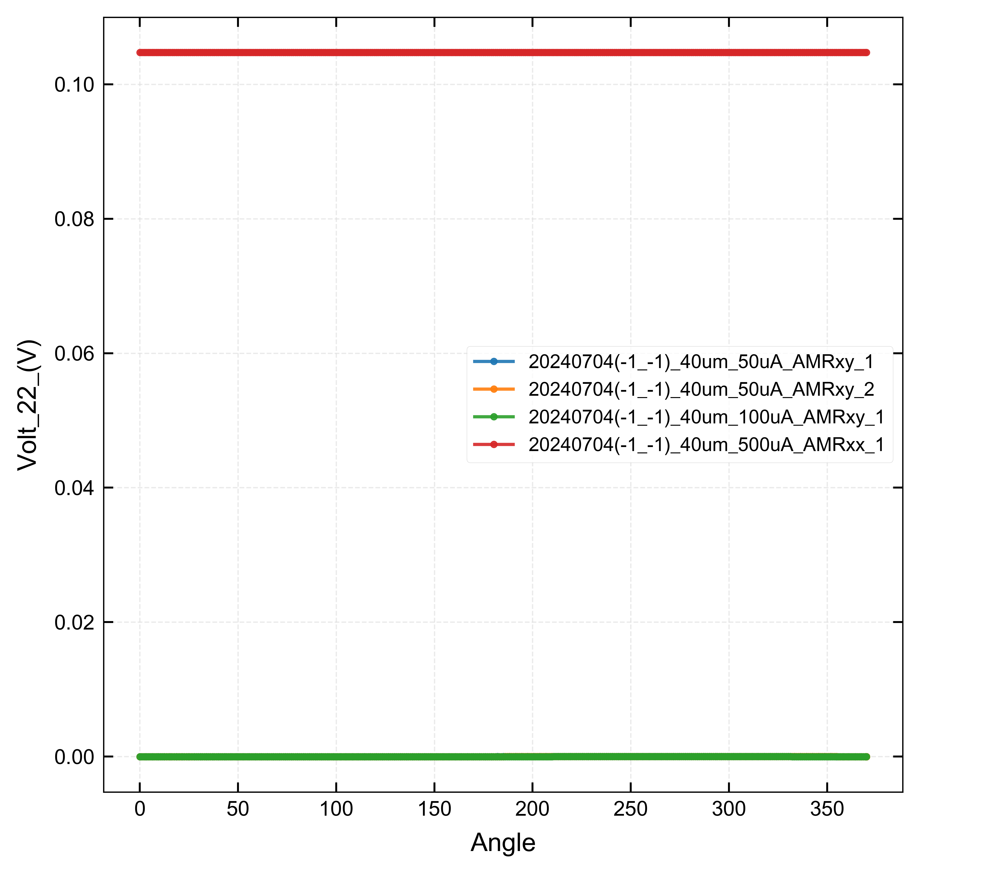
</td>
<td width="50%">
<b>处理后</b> 
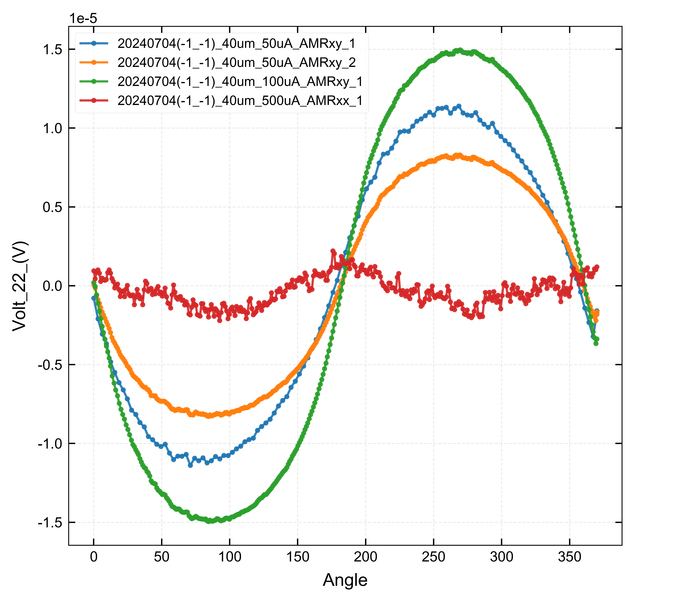
</td>
</tr>
</table>

#### 📏 归一化
将数据缩放到 [0, 1] 范围，便于比较不同曲线横坐标上的差别，例如矫顽场等

<table>
<tr>
<td width="50%">
<b>处理前</b> 
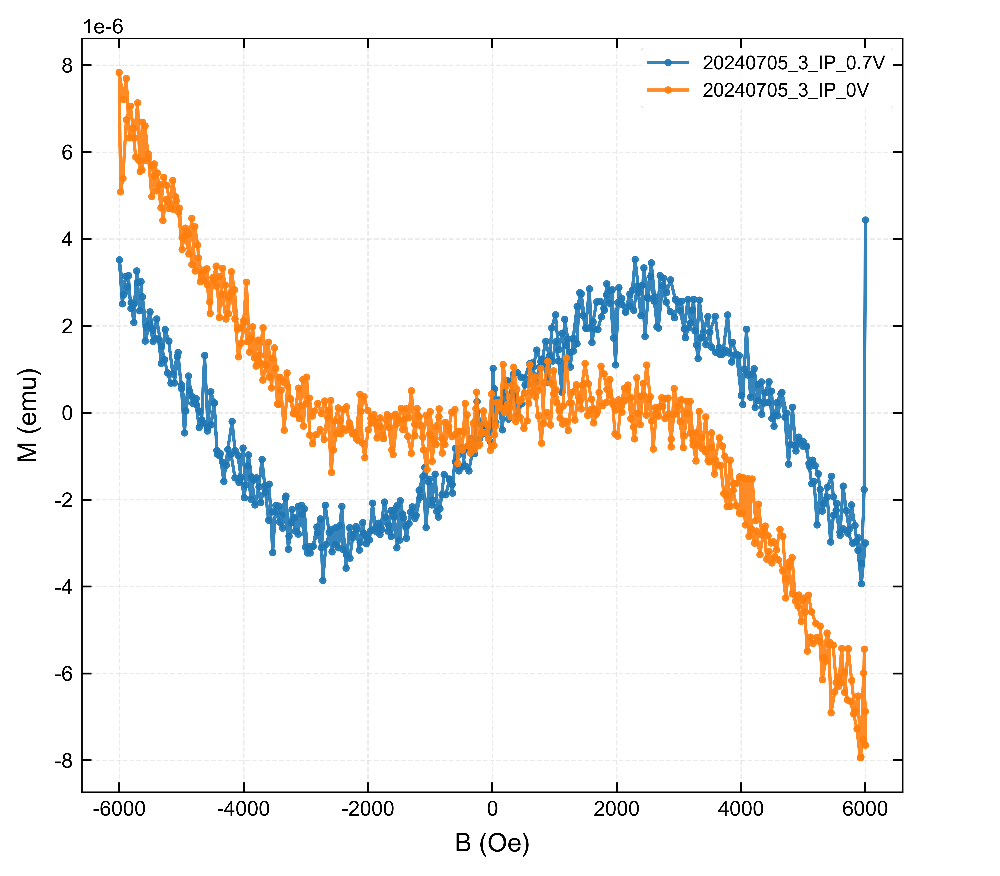
</td>
<td width="50%">
<b>处理后</b> 
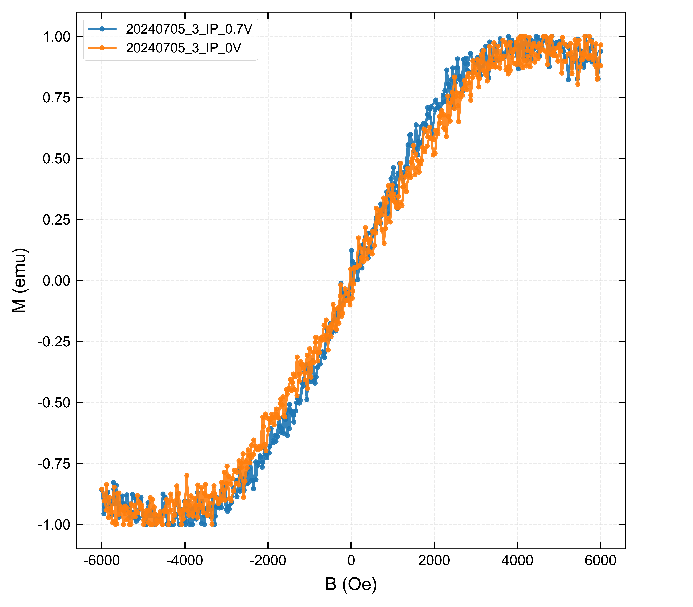
</td>
</tr>
</table>

#### 🧹 去背底
选择合适的背底区间，对于VSM, 可以取这个范围，注意只需要红色方框中x轴对应的最小值和最大值，图中对应大概为6000，8500，可以移动鼠标观察左下角坐标位置。

<table>
<tr>
<td width="50%">
<b>处理前</b> 
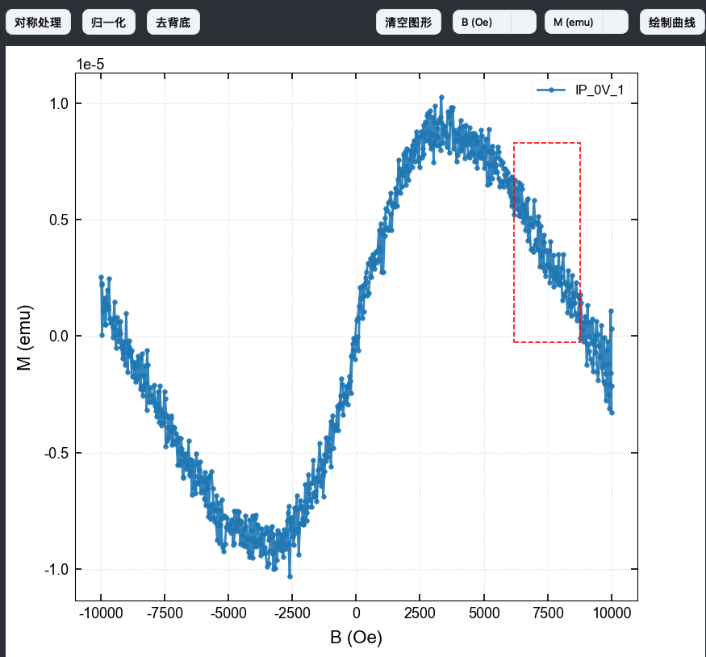
</td>
<td width="50%">
<b>处理后</b> 
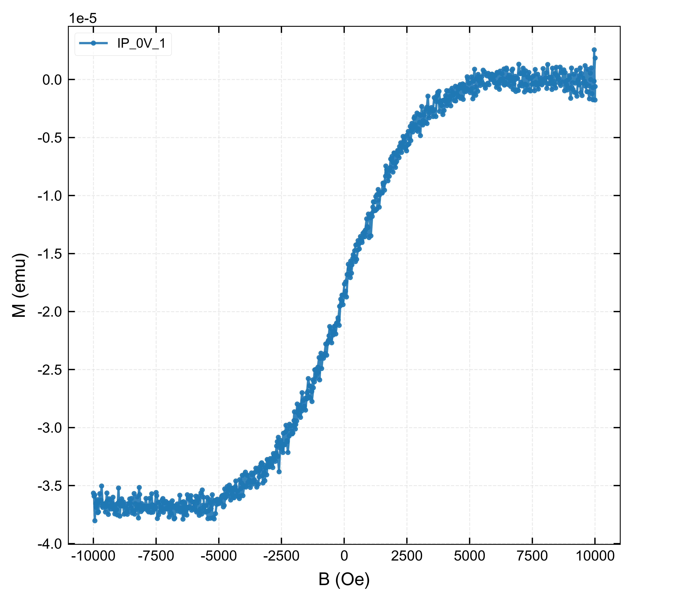
</td>
</tr>
</table>
对于SMR，也需要找到合适的线性背底，可以找到曲线的两个最低点，大约是96，273。第一次去背底有时候并不完美，原因是最低点没有找准。可以进行第二次去背底，换个点，例如最高点也可以，图中对应4.2, 362.
<table>
<tr>
<td width="33%">
<b>处理前</b> 
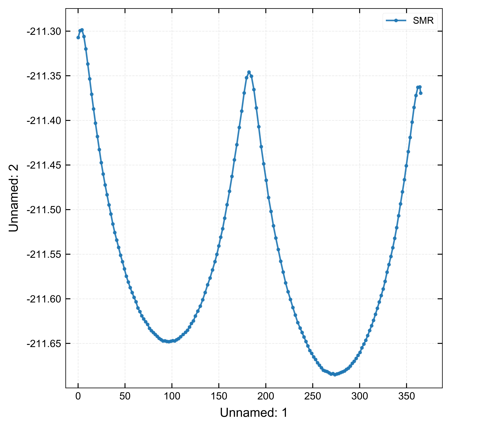
</td>
<td width="33%">
<b>第一次处理</b> 
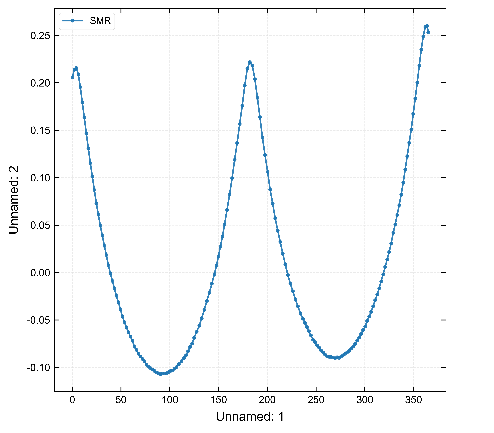
</td>
<td width="33%">
<b>第二次处理</b> 
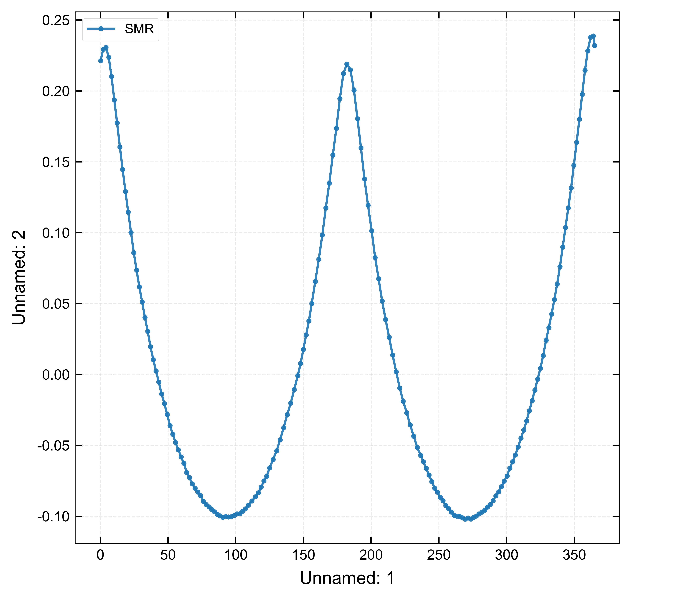
</td>
</tr>
</table>

#### 🗑️ Remove 功能
快速删除多余的点或实验记录中的跳点，可以鼠标左键单击需要删除的点也可以画矩形框同时删去多个点。

<table>
<tr>
<td width="50%">
<b>删除前</b> 
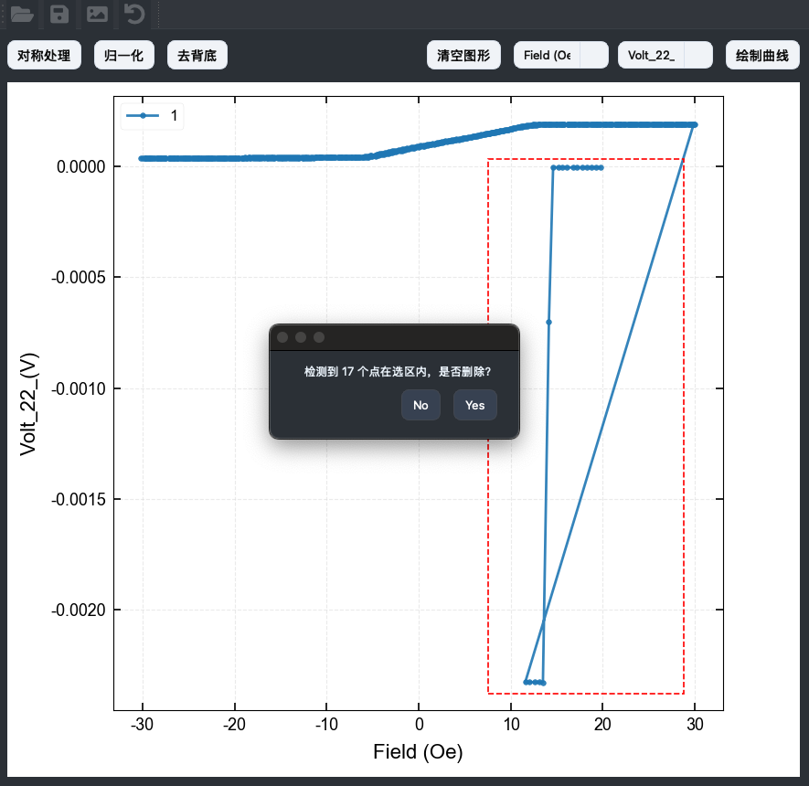
</td>
<td width="50%">
<b>删除后</b> 
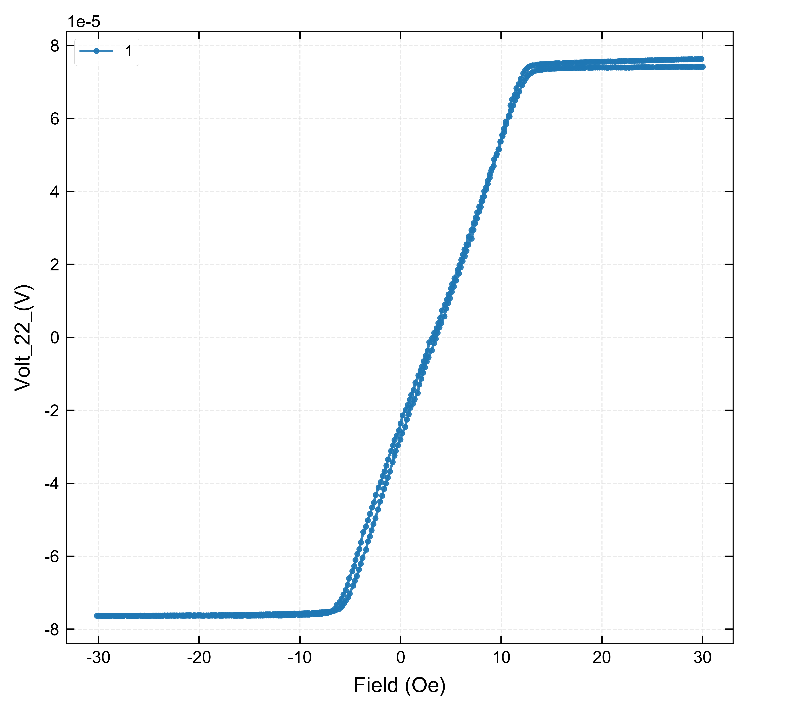
</td>
</tr>
</table>

### 4️⃣ 交互式操作

**鼠标操作**：
- **左键单击** 高亮显示坐标或选择单个要删除的点
- **左键拖拽** - 拉出矩形选择一个或多个要删除的点
- **滚轮** - 缩放图表
- **右键拖拽** - 移动视图

---

## 🙏 致谢

感谢以下开源项目的支持：
- [Python](https://www.python.org/)
- [PySide6](https://www.qt.io/qt-for-python)
- [Matplotlib](https://matplotlib.org/)
- [NumPy](https://numpy.org/)
- [Pandas](https://pandas.pydata.org/)

---

**⭐ 如果觉得软件好用，欢迎推荐给您的同事和朋友！⭐**

