# InstPlot - 实验数据可视化工具

<div align="center">


**简单、便捷的科研数据绘图与预处理工具**

[](pyproject.toml)
[](https://github.com/zhiyuzhang001-a11y/InstPlot/actions/workflows/python-tests.yml)
[](LICENSE)
[](.github/workflows/python-tests.yml)

</div>

> [!IMPORTANT]
> 这是 InstPlot 的原 Python 源码版，用于保留完整功能、算法和项目历史。
> 本仓库不再提供安装包，运行源码需要 Python 环境。希望直接下载安装、无需
> Python 的普通用户，请使用 [InstPlot Lite](https://github.com/zhiyuzhang001-a11y/InstPlot-Lite)。

## 📖 简介

**InstPlot** 主要用于实验数据的即时观察、预处理和绘图，具有操作直接、功能完整的特点。
仓库保留原始 Python 实现、历史计划和测试，也继续接受必要的解析与兼容性修复。

### ✨ 核心特性

- 📊 **多数据源导入**：支持 TXT、CSV、DAT、TSV、XLS 和 XLSX
- 🎯 **数据处理**：对称、归一化、背景去除、局部展平和去噪
- 📐 **曲线拟合**：多项式及多种常用模型
- 🖱️ **交互操作**：缩放、平移、单点选择、矩形选择、撤销与重做
- 🖼️ **图片导出**：支持 PNG、JPG、SVG、PDF 等格式
- 💾 **数据导出**：支持 CSV、TXT 和 Excel 等格式

## 📚 主要功能

### 1️⃣ 数据导入

可以点击工具栏的 **打开文件**，也可以将数据文件直接拖入软件窗口。程序会识别常见分隔符、
文本编码和仪器数据结构；仓库还包含脱敏后的真实文件回归样本。

### 2️⃣ 数据可视化

- 从下拉菜单选择 X 轴和 Y 轴数据列
- 支持中文列名和 LaTeX 格式
- 默认显示点线图、网格和图例
- 支持同时观察和比较多组数据

### 3️⃣ 数据处理

#### 🔄 对称处理

将数据沿 Y 方向居中。当多条曲线的电压或电阻基线差别较大、难以直接比较形状时，
可以用对称处理快速对齐。

<table>
<tr>
<td width="50%"><b>处理前</b><br>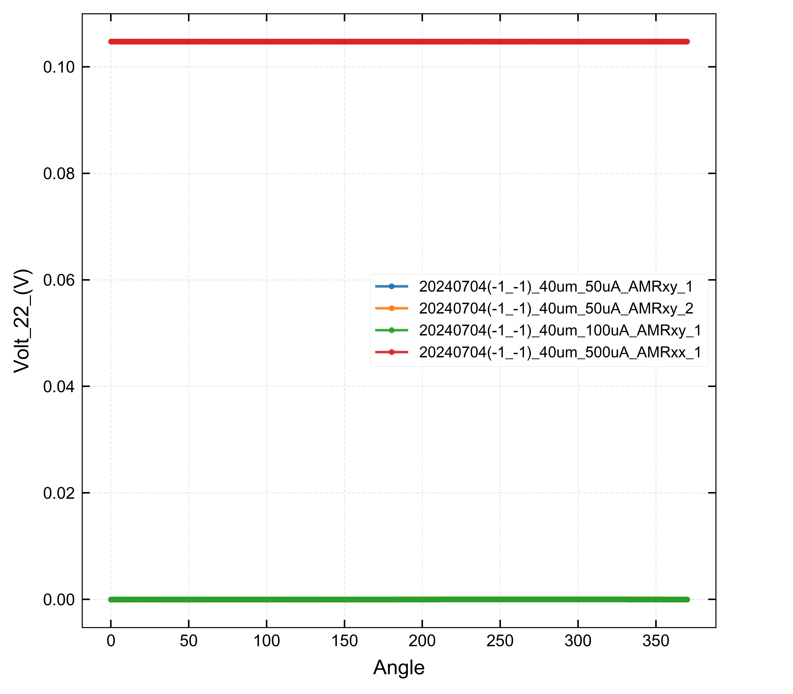</td>
<td width="50%"><b>处理后</b><br>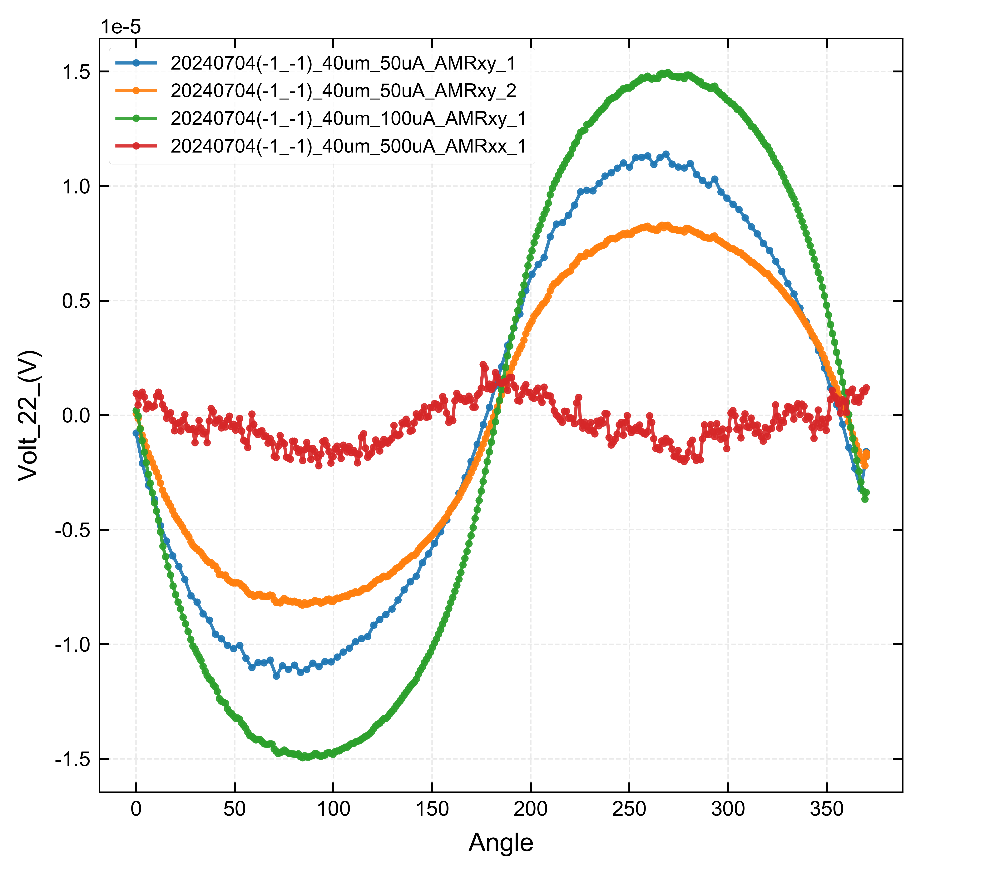</td>
</tr>
</table>

#### 📏 归一化

将数据缩放到统一范围，便于比较不同曲线在横坐标方向上的差别，例如矫顽场位置。

<table>
<tr>
<td width="50%"><b>处理前</b><br>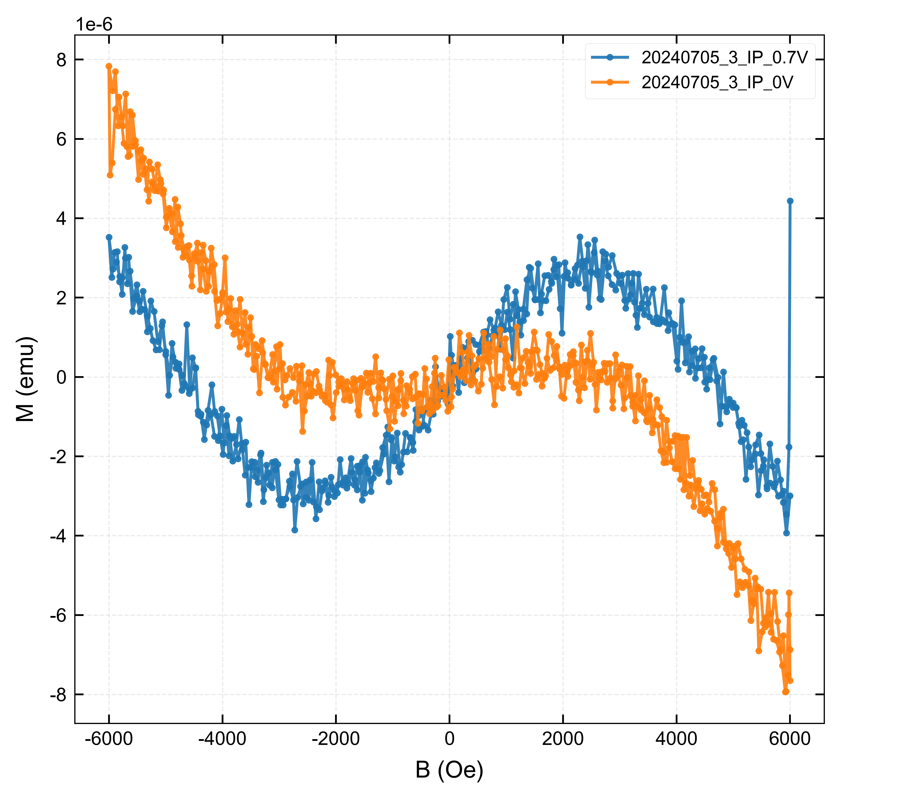</td>
<td width="50%"><b>处理后</b><br>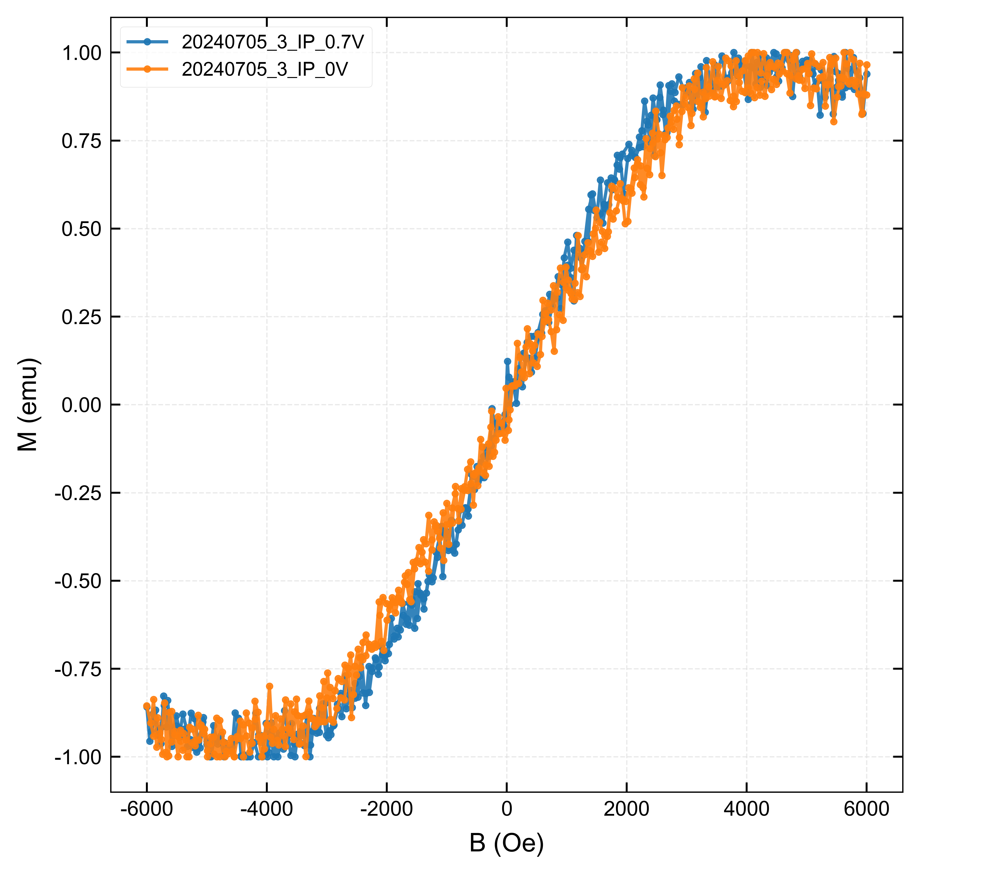</td>
</tr>
</table>

#### 🧹 去背底

选择合适的 X 区间拟合并扣除背景。VSM、SMR 等数据可能需要根据曲线形状选择不同区间，
必要时可以再次处理以改善结果。

<table>
<tr>
<td width="50%"><b>处理前</b><br>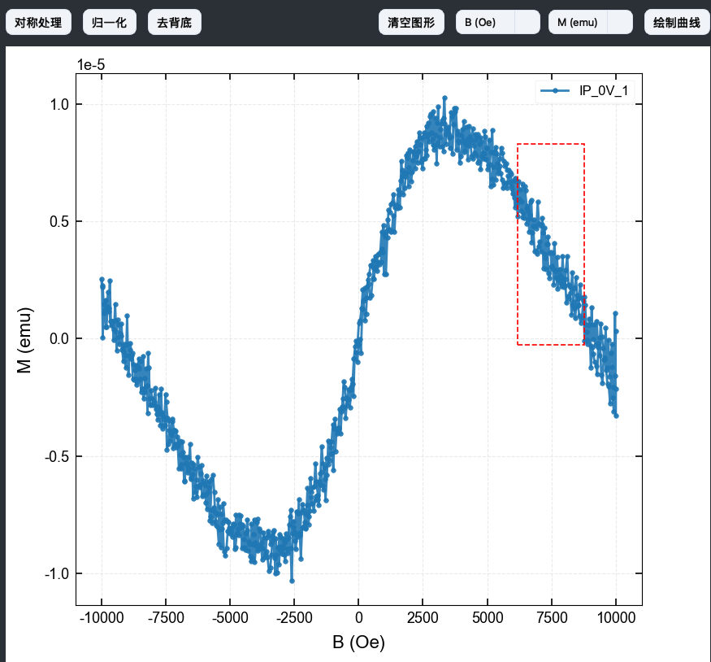</td>
<td width="50%"><b>处理后</b><br>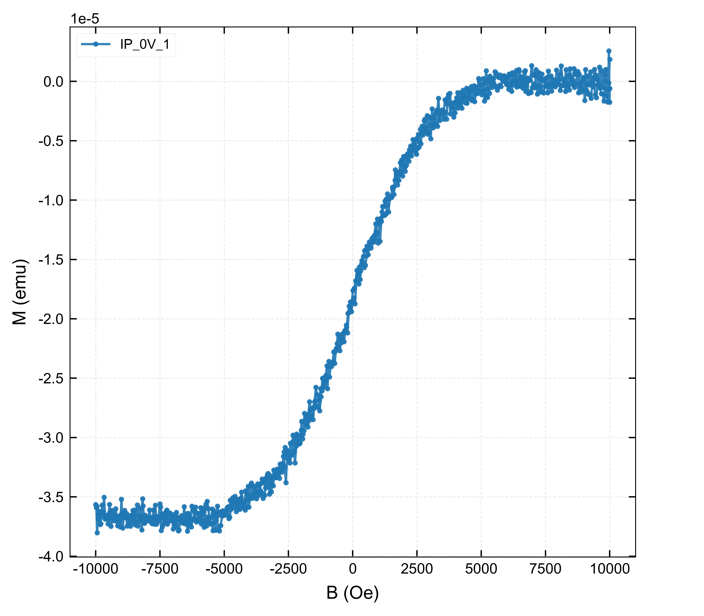</td>
</tr>
</table>

<table>
<tr>
<td width="33%"><b>SMR 处理前</b><br>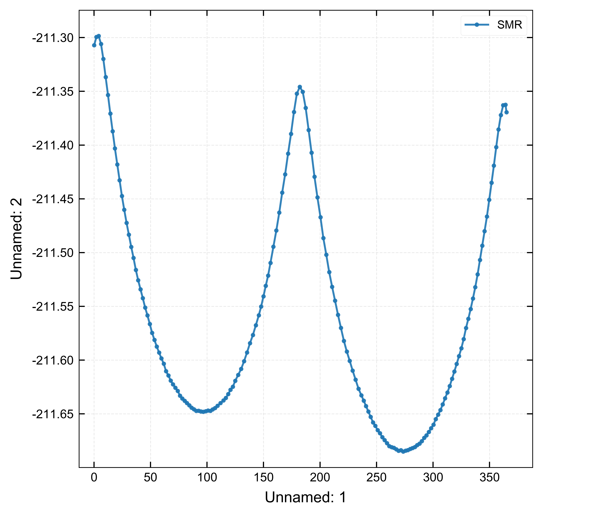</td>
<td width="33%"><b>第一次处理</b><br>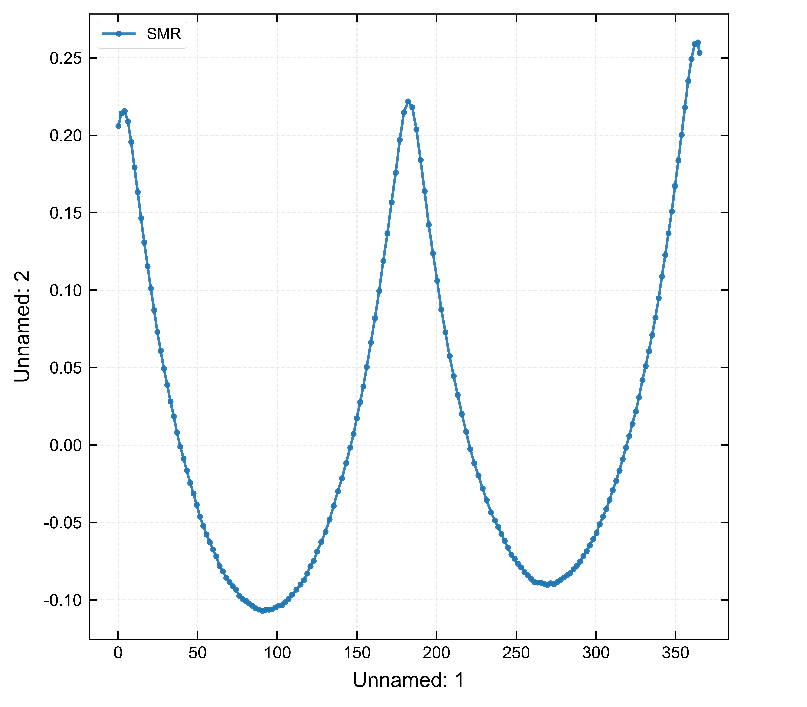</td>
<td width="33%"><b>第二次处理</b><br>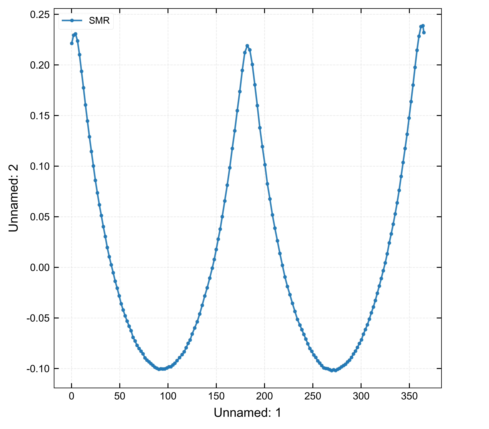</td>
</tr>
</table>

#### 🗑️ 删除数据点

鼠标左键可以选择单个异常点，也可以拖出矩形框一次选择多个点。删除操作可以撤销。

<table>
<tr>
<td width="50%"><b>删除前</b><br>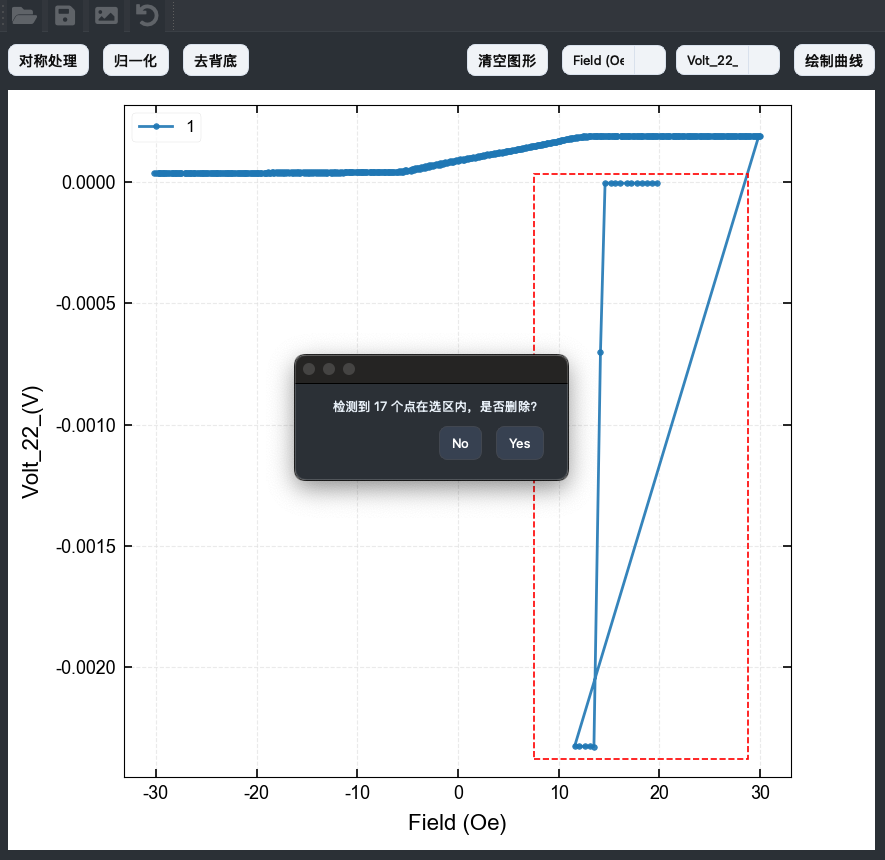</td>
<td width="50%"><b>删除后</b><br>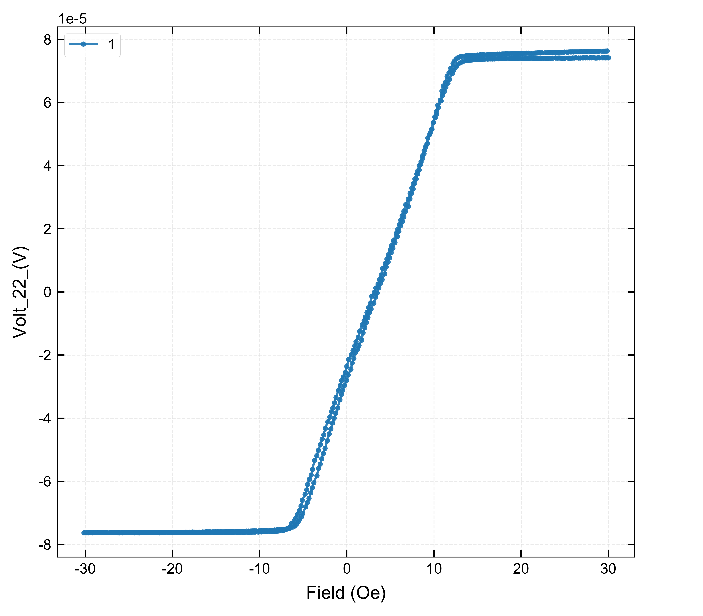</td>
</tr>
</table>

### 4️⃣ 鼠标操作

- **左键单击**：显示坐标或选择单个待删除点
- **左键拖动**：框选一个或多个待删除点
- **滚轮**：缩放图形
- **右键拖动**：平移视图

## 🧑‍💻 从源码运行

本仓库定位为源码版，不提供 EXE、DMG、DEB 或其他预编译安装包。开发和研究旧实现时需要：

- CPython 3.10–3.14
- Windows、macOS 或带桌面环境的 Linux
- Linux 图形环境提供 `libEGL.so.1`；Ubuntu / Debian 对应软件包为 `libegl1`

macOS / Linux：

```bash
git clone https://github.com/zhiyuzhang001-a11y/InstPlot.git
cd InstPlot
python3 -m venv .venv
source .venv/bin/activate
python -m pip install --require-hashes -r requirements.lock
python -m pip install --no-deps .
python -m InstPlot
```

Windows PowerShell：

```powershell
git clone https://github.com/zhiyuzhang001-a11y/InstPlot.git
cd InstPlot
py -3 -m venv .venv
.venv\Scripts\Activate.ps1
python -m pip install --require-hashes -r requirements.lock
python -m pip install --no-deps .
python -m InstPlot
```

运行测试：

```bash
python -m pytest -q
```

维护者重新生成锁文件时使用：

```bash
uv pip compile pyproject.toml --python-version 3.10 --universal --generate-hashes --output-file requirements.lock
```

## 🗂️ 项目资料

- [当前源码版状态](STATUS.md)
- [历史实施计划](docs/IMPLEMENTATION_PLAN.md)
- [历史项目路线图](docs/PROJECT_ROADMAP.md)
- [M2–M7 计划与合同](docs/)
- [历史阶段报告](reports/)
- [真实格式回归样本](tests/fixtures/real_samples/)

## 当前定位

- 继续保留 Python 版完整实现、算法、测试和提交历史
- 可以修复数据解析或兼容性缺陷
- 不再投入安装器、发布包和普通用户分发工作
- 普通用户安装入口统一放在 [InstPlot Lite](https://github.com/zhiyuzhang001-a11y/InstPlot-Lite)

## 🙏 致谢

感谢 Python、PySide6、Matplotlib、NumPy、Pandas、SciPy 以及其他开源项目的支持。

## 🤝 贡献与反馈

欢迎提交 Issue 和 Pull Request。报告数据导入问题时，请附上系统版本、重现步骤和经过脱敏的最小样本，
不要上传包含敏感实验信息的原始文件。

[前往 InstPlot Issues](https://github.com/zhiyuzhang001-a11y/InstPlot/issues)

本项目使用 [MIT License](LICENSE)。
